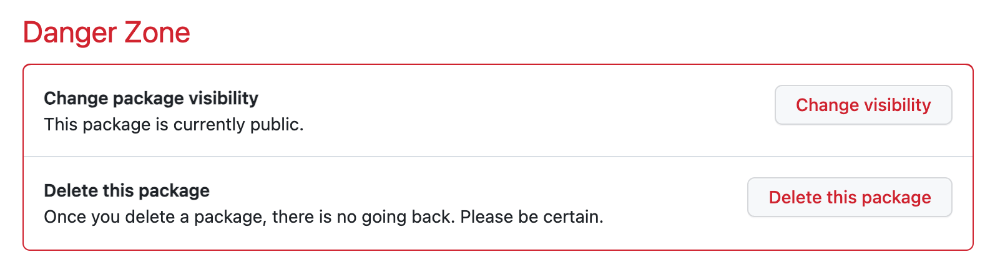
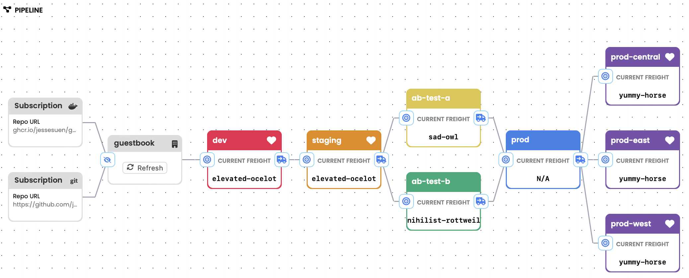

# Akuity ArgoCD + Kargo Quickstart

A GitOps quickstart for the [Akuity Platform](https://akuity.io) that demonstrates advanced Kargo features including multi-stage promotion pipelines, A/B testing with analysis-based verification, and coordination across multiple production regions.

## Features

* A Warehouse which monitors both a container registry for new images and manifest changes in Git
* Multi-stage deploy pipeline with A/B testing
* Promotion of Git changes and image tags via rendered branches
* Verification with analysis of an HTTP REST endpoint
* Argo CD Application syncing
* Control flow Stage to coordinate promotion to multiple Stages

## Requirements

* Kargo v1.10.x ([release notes](https://docs.kargo.io/release-notes/v1.10.0))
* An Argo CD instance (v2.13+)
* GitHub account and a container registry (GHCR.io)
* `git` and `docker` installed

## Instructions

1. Fork this repo, then clone it locally (from your fork).

2. Run `personalize.sh` to update the manifests with your GitHub username and Argo CD cluster destination:

   ```shell
   ./personalize.sh
   ```

3. Commit and push the personalized changes:

   ```shell
   git commit -a -m "personalize manifests"
   git push
   ```

4. Create a guestbook container image repository in your GitHub account.

   The easiest way is to retag and push an existing image with your GitHub username:

   ```shell
   docker buildx imagetools create \
     ghcr.io/akuity/guestbook:latest \
     -t ghcr.io/<yourgithubusername>/guestbook:v0.0.1
   ```

5. Change the guestbook container image repository visibility to **public**.

   In the GitHub UI, navigate to the "guestbook" container repository → Package settings → change visibility to public. This allows Kargo to monitor the registry without credentials.

   

6. Download and install the Kargo CLI:

   ```shell
   ./download-cli.sh /usr/local/bin/kargo
   ```

   Or download directly from [Kargo Releases](https://github.com/akuity/kargo/releases).

7. Login to Kargo and Argo CD:

   ```shell
   kargo login https://<kargo-url> --admin
   argocd login <argocd-hostname>
   ```

8. Create the root App of Apps in Argo CD to bootstrap the ApplicationSet and Kargo resources:

   ```shell
   argocd app create -f ./quickstart-aoa.yaml
   ```

   This will create the `guestbook` ApplicationSet (one app per environment) and the `akuity-argocd-kargo-quickstart` Kargo application.

9. Add Git repository credentials to Kargo so it can commit rendered manifests:

   ```shell
   kargo create credentials github-creds \
     --project akuity-argocd-kargo-quickstart \
     --git \
     --username <yourgithubusername> \
     --repo-url https://github.com/<yourgithubusername>/akuity-argocd-kargo-quickstart.git
   ```

   Ensure the token has write access to the repository.

10. Promote the image!

    Visit the `akuity-argocd-kargo-quickstart` Project in the Kargo UI to see the deploy pipeline.

    

    Click the target icon to the left of the `dev` Stage, select the detected Freight, and click `Yes` to promote. Once promoted, the freight will be qualified to promote downstream (`staging`, `ab-test-a/b`, `prod`, regional prod stages).

## Simulating a release

Retag an image with a newer semantic version to simulate a new release:

```shell
docker buildx imagetools create \
  ghcr.io/akuity/guestbook:latest \
  -t ghcr.io/<yourgithubusername>/guestbook:v0.0.2
```

Then refresh the Warehouse in the Kargo UI to detect the new Freight.

## Promoting Manifest Changes

Edit any file under the [`base`](./base) directory. For example, add an environment variable to `guestbook-deploy.yaml`:

```yaml
        env:
        - name: FOO
          value: bar
```

Kargo will detect the Git change and promote it through the pipeline the same way as image tag updates.
